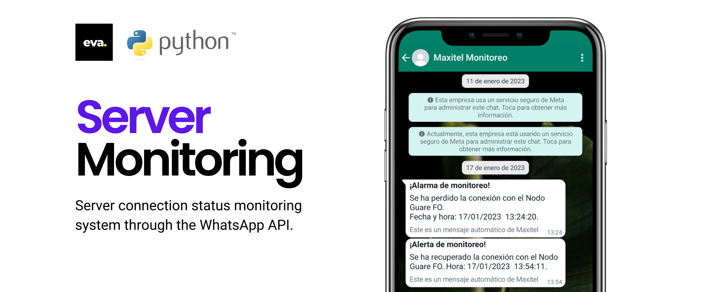
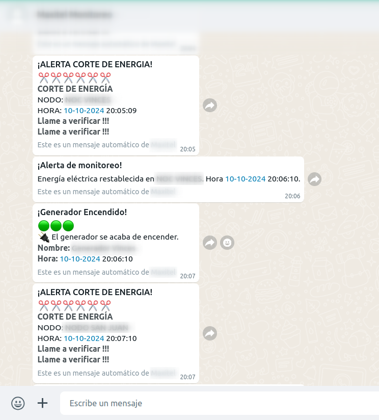
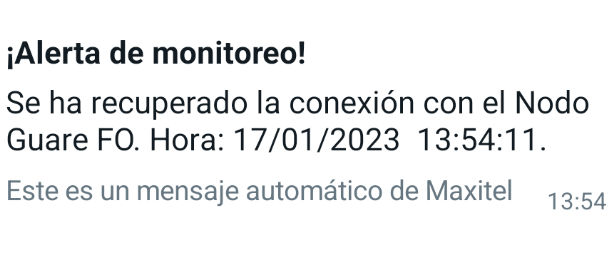
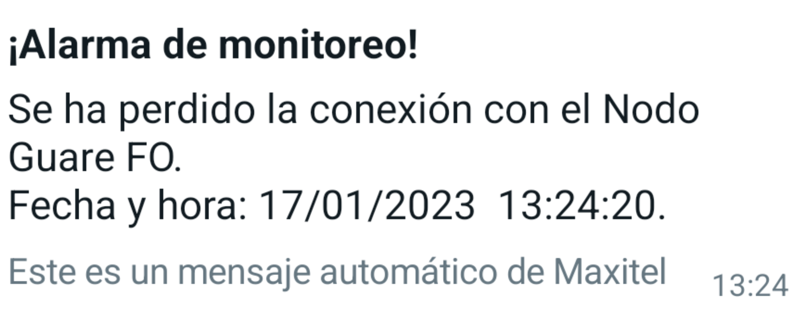

# Server Monitoring and Alert System

Real-time alert system for monitoring server connections and antenna status using WhatsApp or other messaging platforms.

## Table of Contents
- [Introduction](#introduction)
- [Features](#features)
- [System Architecture](#system-architecture)
- [Technologies Used](#technologies-used)
- [Installation and Setup](#installation-and-setup)
- [Contact](#contact)

## Introduction

This system provides real-time alerts for server monitoring and antenna status of UISP antennas. Developed in Python, it runs on a Linux server and sends notifications on server or antenna connectivity status via WhatsApp, Messenger, or other messaging platforms. The system is highly scalable and can easily integrate with additional notification services.

The system utilizes MongoDB to store essential information, such as:
- Server details to be monitored.
- UISP UNMS antenna details.
- Recipient contact details for notifications.

Additionally, it connects to external APIs like the UISP API to gather antenna data and Meta's official API for sending WhatsApp notifications. With its Dockerized environment, this system is easy to deploy on any server.

## Features

The server monitoring system includes the following key features:

- **Real-time Monitoring:** Continuously checks server and antenna connectivity status.
- **UISP UNMS Integration:** Retrieves antenna information from UISP systems.
- **Real-time Alerts:** Sends notifications through WhatsApp or other messaging platforms when a server or antenna is down.
- **Restoration Alerts:** Notifies users when connectivity is restored.
- **Recurring Alerts:** Sends reminders every 15 minutes for persistent downtime.
- **Event Logging:** Stores all event logs, including downtime and restoration details, in MongoDB.
- **Dynamic IP Monitoring:** Reads and tracks IP addresses of servers and antennas dynamically.
- **Multiple Recipients:** Allows multiple contacts to receive notifications simultaneously.
- **Scalability:** Can be extended for deployment in a web interface.
  

  
  

## System Architecture

The system architecture is built around the following components:
1. **Server and Antenna Monitoring:** Regularly checks the status of servers and UISP antennas.
2. **MongoDB:** Stores server, antenna, and recipient data.
3. **External API Connections:** Utilizes the UISP API for antenna data and Meta's official API for WhatsApp message delivery.
4. **Notification System:** Sends real-time alerts through the configured messaging platforms.
5. **Dockerized Environment:** Ensures easy deployment on any server with Docker.

## Technologies Used
- **Python** for backend logic and API integrations.
- **MongoDB** for data storage and management.
- **Docker** for containerization and deployment.
- **UISP API** for antenna monitoring.
- **Meta API** for sending WhatsApp messages.

## Contact
For any inquiries or further information, feel free to reach out:

LinkedIn: [edwin-veloz-2153a9137](https://www.linkedin.com/in/edwin-veloz-2153a9137/)  
Email: edwin06111998@gmail.com